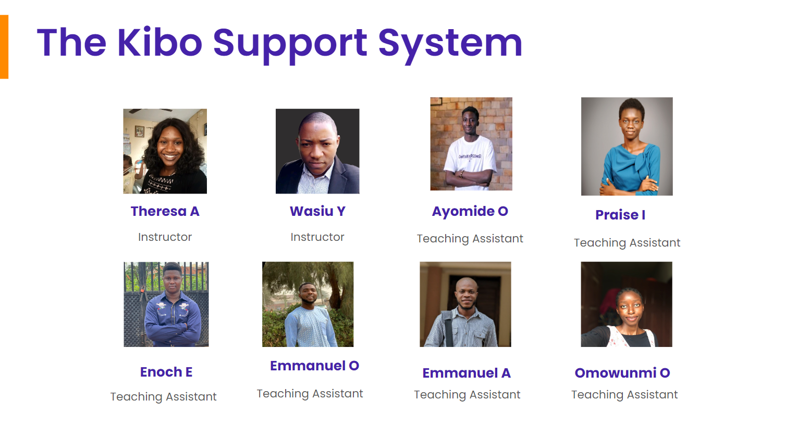
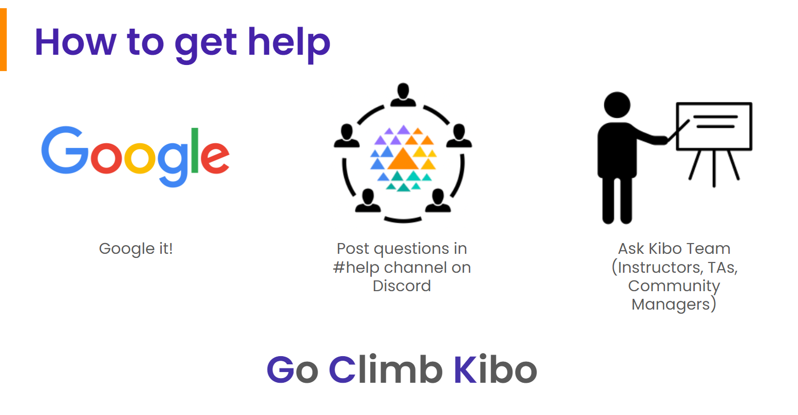

# Start Onboarding
---
**Deadline: Thursday, May 2 at 12pm GMT.**

Welcome to Try Kibo onboarding. You’re now ready to get set up for class. Ensure to read and understand all the information below as you will be asked some questions at the end of this process. 

<aside>

🚨 Watch this video from Emmy to see all the steps you need to complete

</aside>

  <iframe width="100%" height="600" src="https://www.loom.com/embed/69ea685579874a0b84ae5ae218632abc?sid=07e608ad-abbb-4c57-89e2-fd09f8bcd2d5" title="Onboarding for Try Kibo" frameborder="0" allow="accelerometer; autoplay; clipboard-write; encrypted-media; gyroscope; picture-in-picture; web-share" allowfullscreen></iframe>

During this process, you will:
* Select a live class.
* Join your class Replit team.
* Learn about how you will learn at Kibo.
* Join Discord, update your profile, and introduce yourself.
* Submit an onboarding checklist form

As you get through these steps, you will complete 3 activities that will help us verify that you are ready for class.

>

# Virtual sessions during Try Kibo

While you study at Kibo, there will be weekly live events that you will attend. These events are:

* **Live class(90 minutes)**: Mandatory weekly live sessions on Google Meet, led by an instructor or teaching assistant. It will include collaborative problem-solving (1 hour) and opportunities to ask questions about your lessons (30 minutes). You will select a live class time below.

* **Office hours (60 minutes)**: Personalized help with your projects and lessons. This session is optional and led by a teaching assistant.

* **Community Friday (60 minutes)**: Career-focused events featuring tech professionals and mentors like software engineers, product managers, and data scientists.

### Activity 1 - select a live class

Below is a list of weekly live classes available. Submit the form below to pick a live class time that works best for you. You can only select one live class. Time is in GMT(convert to your local timezone)

| Time (in GMT) | Day | Led by |
| --- | --- | --- |
| 5:00pm GMT | Tuesdays | Ayomide O |
| 3:00pm GMT | Thursdays | Theresa A |
| 7:00pm GMT | Fridays | Praise I |
| 5:00pm GMT | Saturdays | Omowunmi O |

<iframe src="https://forms.gle/cVGQ5wx2W4MtcmWM8" frameborder="0" sandbox="allow-scripts allow-popups allow-top-navigation-by-user-activation allow-forms allow-same-origin" allowfullscreen="" style="width: 100%; height: 100%; border-radius: 1px; pointer-events: auto; background-color: white;"></iframe>

>

# Learning at Kibo 

You will be learning with peers, instructors, and teaching assistants from across the continent. In this section, you will learn about the support system available to you and how you can get help.

* **The Kibo Support System:** This includes community managers, instructors, and teaching assistants who are available to help you throughout your learning journey. Feel free to reach out and connect with any of them

* **How to get help:** Even though you will have a host of people who will support you throughout your journey, you will also refine your problem-solving abilities. As a rule of thumb, if you need help with your lessons, follow these steps to get help.
    * **Google:** Try to find answers to your questions online – a great way to polish your Google searching skills
    * **Community:** Ask your peers in the #help channels on Discord. They might have similar questions or answer
    * **Kibo:** If you still need assistance, contact the Kibo team—your instructor, TAs, or community managers.

# Tools for Success

During your class, you will use various tools for your learning. These tools are:

* **Anchor:** If you can read this, you are on Anchor. All your lessons will be released here – bookmark this site: <a href="https://lms.kibo.school/" target="_blank"> lms.kibo.school </a>
* **Replit:** You will write your code and submit it using. It has everything you need to build and run computer programs. You will join a replit team to access your lessons below
* **Zoom & Google Meet:** You will use these tools to attend your live classes, office hours, and events.
* **Discord:** This is our community platform, where you'll communicate and connect with peers and instructors. Joining Discord is mandatory once the program starts, as all communication from the Kibo team will be conducted there. You will join Discord and introduce yourself below

### Activity 2 – Join Replit Team

You have already created a Replit account during the admissions challenge. Now, you need to join the Replit team so you will be able to access your work in class.

* Go to <a href="https://replit.com/~" target="_blank">replit.com</a>
* Select "Log in" at the top right corner to login to your account
* <a href="https://replit.com/teams/join/nnwfwefcipyhekybvhxgrdndvorfkfhg-tk12-fpwp" target="_blank">Click this link </a> to join the Replit team for the class.

### Activity 3 – Join Discord and complete the onboarding checklist

After the class starts, all communication from the Kibo team will occur on Discord, so joining is mandatory. Follow the steps below to join Discord, introduce yourself, update your profile, and complete the onboarding checklist form.

🚨**Note:** If you witness any delays trying to join Discord, be patient and try again in a few hours. Discord may ban your account if they see multiple activities happening at one time, and it may take up to 20 days to resolve.

* If you already have a Discord account, <a href="https://discord.com/login" target="_blank">log in</a>. Otherwise, create an account and verify it via email. Check your spam folder if the email is not in your inbox
* Join the Try Kibo Discord Server: <a href="https://discord.gg/skbZYFttNP" target="_blank">https://discord.gg/skbZYFttNP</a> and follow the steps until you submit the onboarding checklist

    **Steps**
    * Introduce yourself in the #introductions channel
        * Your full name
        * Your location(city, country)
        * A fun fact about you
        * An image or gif that represents you
    *  Update your Discord name to your first name and last initial e.g., "Jessica A", "Sydney W"
    *  Add a preferred profile picture
    *  Submit the onboarding checklist form

Once you have done all the above, you’re ready for class! You will get an invite to the mandatory orientation on or before the end of today.

>

### Orientation date: Friday, 3rd May from 2 - 3:30pm GMT. Mark your calendar
